

  

<h1 align="center">
  I-made-minecraft-in-unity
</h1>

<h3 align="center">
  🧱 🚀🧱
</h3>
<h3 align="center">
  Just a clone of a not very well-known cube game
</h3>

## About

This is a game made just by the simple fact that I was a little bored and wanted to study more about the voxel system. It contains some bugs and I probably won't fix them, but I give you the freedom to do what you want with it.
Have a good time!

## Features

When giving play you will realize that you will be falling infinitely ... Don't worry, the terrain is being generated and you will soon be on solid ground.

You can walk (WASD), run (shift), jump (space), break blocks (LMB), add blocks (RMB) and switch between blocks (mouse wheel).

Some blocks such as sand, gravel and snow may fall.

The water blocks are solid and can spread.

<h1 align="center">
    <i>Okay, so that would be a bug?</i>
</h1>

  

## Annotations

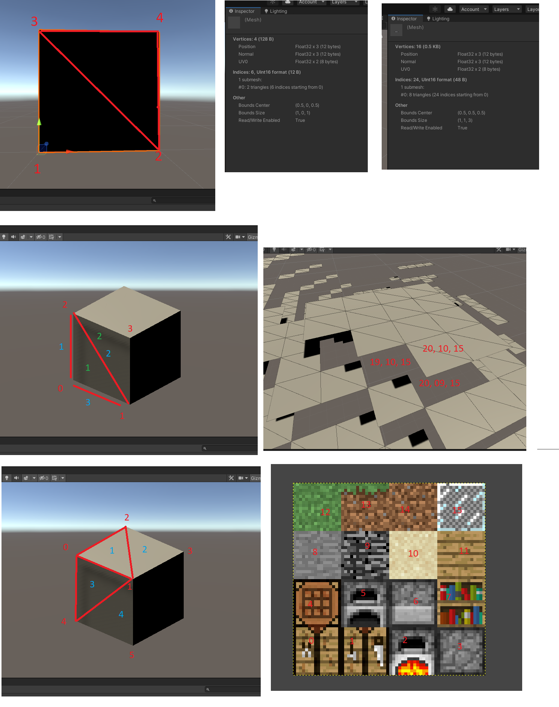

## Evolution

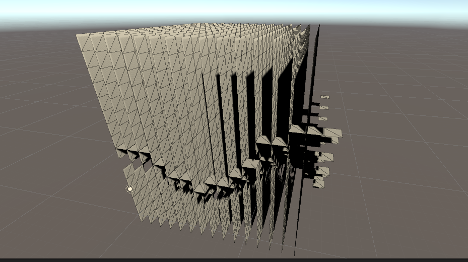

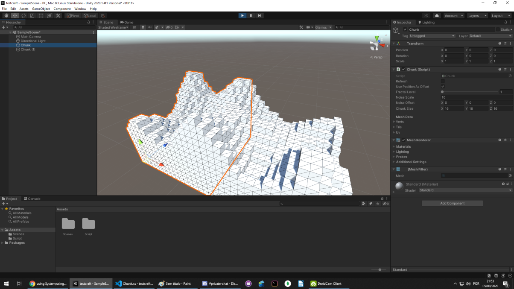

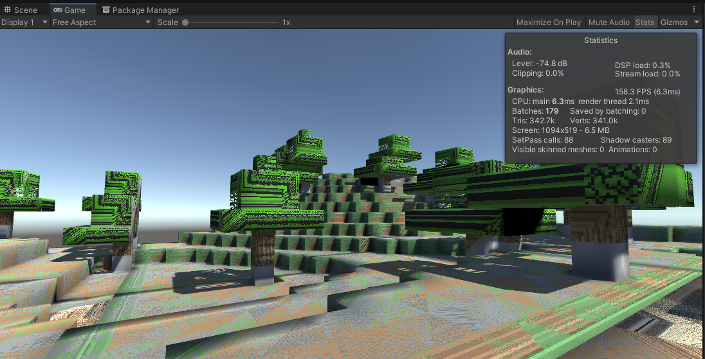

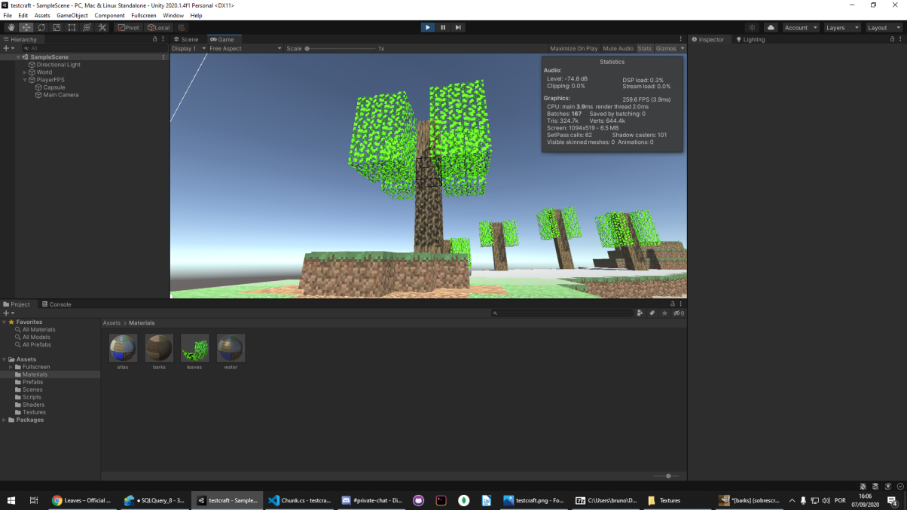

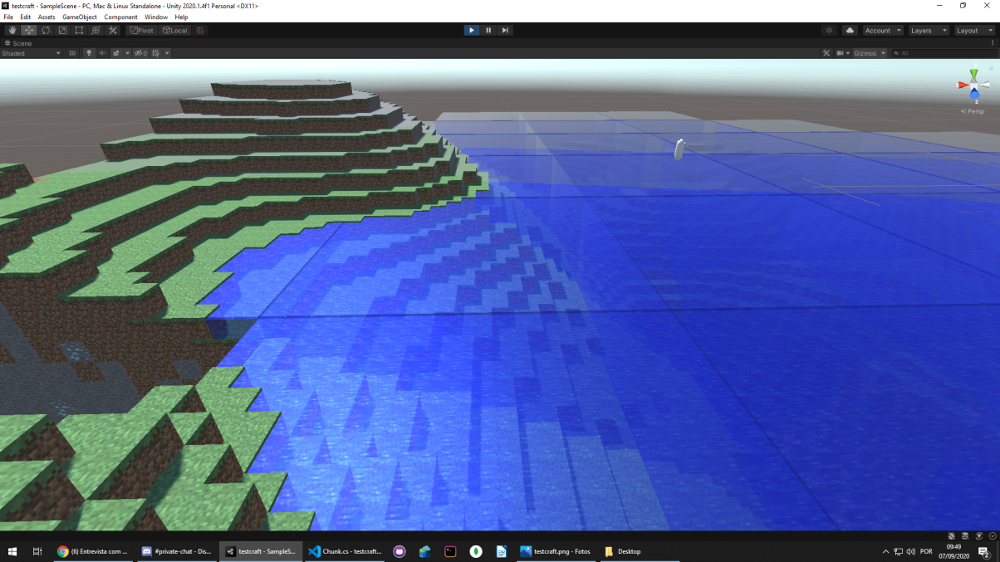

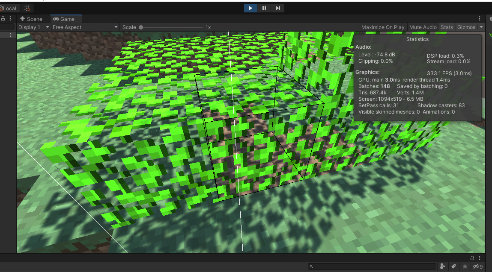

## Screenshots

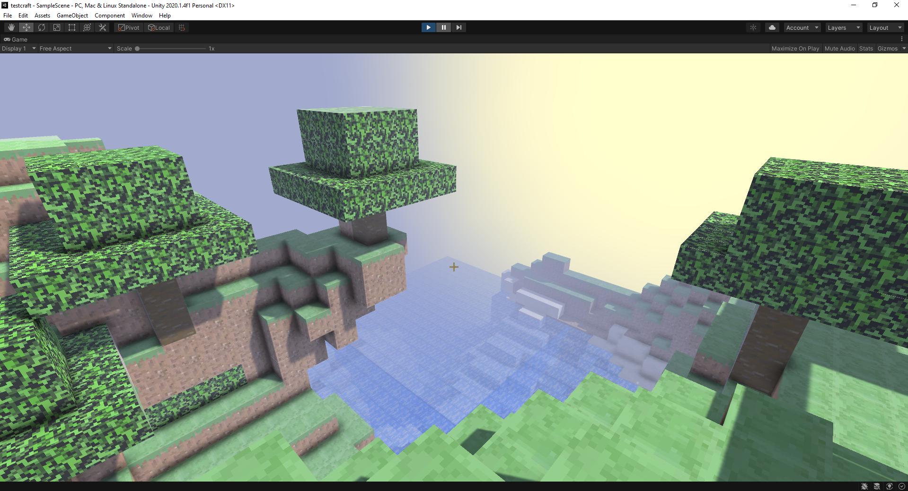

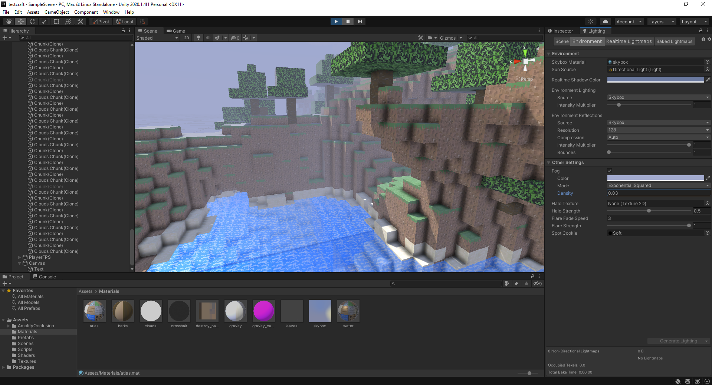

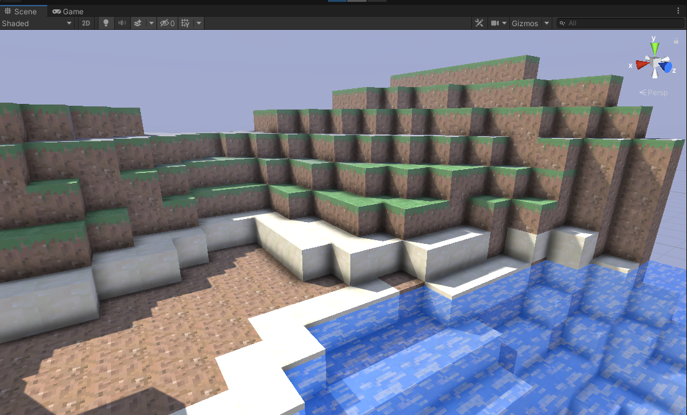

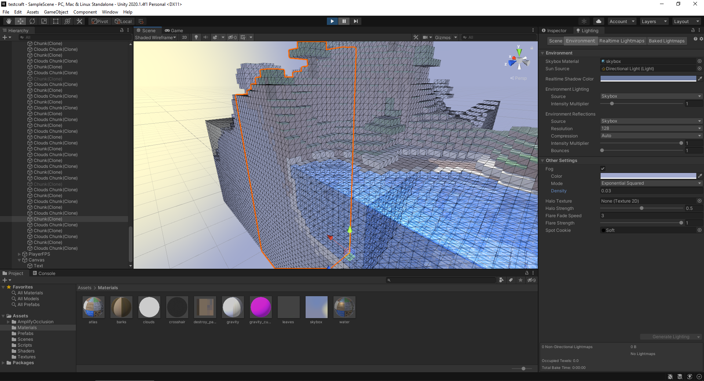

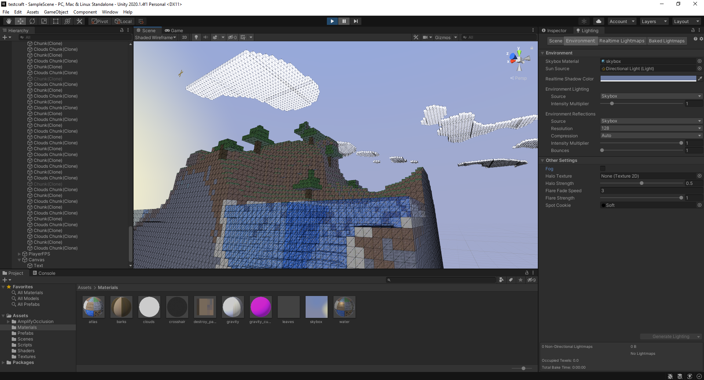

end.
